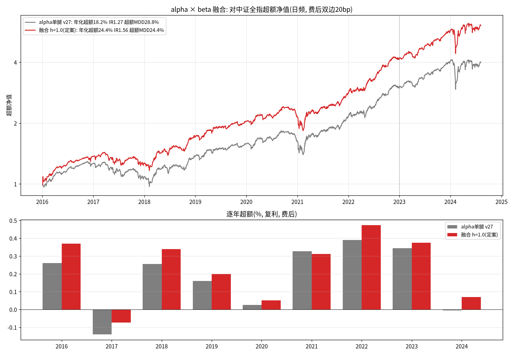

# peer-anchor-mispricing-alpha

**A 股中小盘双引擎策略栈：同伴锚 × 微观行为选股 (alpha) + 噪声区间破位择时 (beta)**

> 从公开的跨股预测研究出发，经 50 余轮实证演化与消融，形成一套"选股 alpha + 择时 beta"的
> 完整策略栈。全部结论附对照实验，判负记录与成功记录同等完整地保留。

---

## 一、成绩速览

训练+验证区间 **2016-01 ~ 2024-08-16**（2015 年因杠杆牛+股灾+千股跌停不可交易而永久剔除），
基准 **中证全指 (000985)**，成本 **双边 20bp**。
**测试段 2024-08-19 ~ 2026-08-06 已于 2026-08-28 一次性开封，按预注册标准判定为通过。**

| 策略层 | 年化超额 | IR | 超额最大回撤 |
|---|---|---|---|
| alpha 单腿 (v27 选股) | 18.2% | 1.27 | 28.8% |
| beta 单腿 (破位做空, 绝对收益) | 6.0% | 0.99 (Sharpe) | 5.0% (绝对 MDD) |
| **融合 h=1.0（定案）** | **24.4%** | **1.56** | **24.4%** |

产品口径（周频、T+1 拆分执行）下 alpha 单腿为 **17.0% / IR 1.07**；
日频口径用于与 beta 对齐，两者差异见 `docs/execution.md`。

### ★ 样本外测试段结果（2024-08-19 ~ 2026-08-06，96 周，从未参与任何调参）

| | 超额年化 | IR | 超额MDD | 绝对年化 | 绝对MDD | 判定 |
|---|---|---|---|---|---|---|
| alpha 周频（产品口径） | **19.4%** | **1.24** | 21.9% | 49.6% | 24.4% | **PASS** |
| 融合 h=1.0 | **21.2%** | **1.26** | 23.4% | 51.7% | 27.5% | **PASS** |
| beta 单腿 | 1.3% | 0.36 | 3.1% | — | — | — |

> 上表为采纳组合约束（B2）前的口径；加入行业偏离带后 test 超额为 19.3%、IR 1.24（−0.2pp）。

预注册标准（SHA `25f77c5b1dad`）：超额>0 且 IR>0.5 为通过。样本外无衰减（test 19.4% > val 18.6% > dev 17.0%）。

**随机组合零基准（500 次，非参数）**：同域随机挑 200 只、同规则换手，dev/val/test 三段
策略均 100% 超越，test 段 **z = 9.0σ**；且随机组合本身是亏的（test −1.5%），
证明超额来自选股而非域的天然优势。详见 [`docs/robustness_and_weighting.md`](docs/robustness_and_weighting.md)。

⚠️ 三条限定：① 96 周 IR 1.24 对应 t≈2.4，**未过 Bonferroni 门槛**，是"通过预注册标准"而非"统计确证"；
② 绝对回撤仅 24% 是因这两年微盘走强，**beta 问题未发作而非已解决**；
③ **beta 腿在测试段几乎未触发**（在场 2.1%），其样本外证据显著弱于 alpha 腿。
详见 [`docs/open_issues.md`](docs/open_issues.md)。



---

## 二、策略结构

### 2.1 alpha 引擎：同伴锚 × 微观行为选股 (v27)

```
硬剔（仅机制性不可买）  停牌 / 当日封涨停 / ST / 活跃域外
活跃域                  过去 250 日收盘封涨停 ≥ 2 次（约 2000 只）
综合分 = 锚块 40% + 微观行为 40% + 结构判断 20%
  锚块(5)   价格 gap · zspread · 价量双确认 gap · 转移熵有向 gap · ROE gap
  行为块(2) −扫单卖占比 · −卖单平均规模（前 5 日逐笔重构）
  结构块(2) 价格 ≥ 2 元 · ΔROE 未恶化
组合                    N=200，权重 ∝ 综合分，缓冲带 600，周频调仓
约束                    个股 ≤1% + 行业偏离 ≤±5%（治理性，代价 −0.2pp）
```

**核心机制**：买"相对同伴股超跌"的标的，但只在抛售来自**散户情绪**而非**知情资金撤离**时买。
消融显示卖单平均规模是最大支柱（去掉 −5.4pp），五个锚为冗余互补结构。

详见 [`docs/alpha_v27_spec.md`](docs/alpha_v27_spec.md)

### 2.2 beta 引擎：噪声区间破位做空

```
标的       CNI2000 > CSI1000 > CSI500（规模越小越强）
信号       σ(T) = 过去 14 日 |close_d(T)/open_d − 1| 均值（shift 1）
           边界 = 今开 × (1 ± 2.5σ)
时点       10:00 / 10:29 / 11:29 / 13:59 的 bar 收盘判定，下一根 bar 开盘成交
方向       只做空头腿（多头腿已判负）
离场       次日第一根 bar 开盘（★必须精确落在开盘那一刻）
仓位       每笔 0.25 单位，同日最多 4 笔 ⇒ 峰值 1.0x
```

**收益来源**：大幅下跌的隔夜延续性；未被套利掉的三个 A 股结构性障碍为
T+1 与融券稀缺、股指期货贴水、2015 后保证金与限仓。
最有力证据是**不对称性**——同一套规则空头活、多头死。

详见 [`docs/beta_breakout_replication.md`](docs/beta_breakout_replication.md)

### 2.3 融合

两引擎相关性近零（beta 在场时间仅 9%，方向相反）。
定案 **h = 1.0**：alpha 多头 1.0x + beta 空头峰值 1.0x，不引入额外杠杆。

融合修复了 alpha 的两个弱年（2017 −10.5% → −5.7%，2024 ≈0 → +6.6%），
唯一 alpha 更优的年份是 2021 —— 恰为 beta 九年中唯一负年，两者弱点重合。

⚠️ **融合改善的是超额回撤（28.8% → 24.4%），不是绝对回撤（55% → 47%）**。
月级别风格崩塌的保护仍然缺位，需外部宽度风控信号，见 `docs/open_issues.md`。

---

## 三、目录结构

```
├── src/
│   ├── alpha/        选股引擎全部实验脚本（按版本编号 01~87）
│   ├── beta/         破位择时复现与检验脚本
│   ├── fusion/       融合回测与绘图
│   └── live/         生产流水线：建数据 → 出持仓 → 定时任务
├── config/           冻结的策略配置（含 SHA 存证）
├── data/             1 分钟指数面板（gitignored，由脚本构建）
├── cache/            中间缓存（gitignored，约 3GB）
├── output/{alpha,beta,fusion}/   指标 JSON / 净值序列 / 运行日志
├── charts/           各版本净值图与诊断图
├── docs/             规格文档、实验全记录、判负清单
├── src/paths.py      路径统一解析（项目根自动推导 + 数据源环境变量）
└── papers/           参考论文（gitignored）
```

## 四、复现

```bash
pip install -r requirements.txt
cp .env.example .env    # 按自有数据环境填写路径, 或直接 export

# 1. 构建缓存（日频网格、L2 逐笔特征、资金流、指数面板）
python src/alpha/01_build_cache.py
python src/alpha/56_tick_features.py
python src/beta/build_idx1m_panel.py

# 2. alpha 引擎定型回测
python src/alpha/87_v27_final.py

# 3. beta 引擎
python src/beta/freeze_and_open.py

# 4. 融合
python src/fusion/88_fusion_alpha_beta.py
python src/fusion/plot_fusion.py
```

所有路径由 `src/paths.py` 统一解析：项目根自动推导（或用 `PROJ_ROOT` 覆盖），
数据源由环境变量指定。数据依赖清单与关键口径见 [`docs/data_requirements.md`](docs/data_requirements.md)。

## 五、实盘运行

研究期的缓存散落在 90+ 个脚本里作为副产品（网络藏在涨停共现探测脚本、基准收益
藏在条件化实验脚本）。生产不能依赖"跑某个研究脚本的副作用"，`src/live/` 是独立
重写的流水线：

```bash
python src/live/pipeline.py --stage all      # S1 日线 → S5 网络，串行增量
python src/live/pipeline.py --check          # 新鲜度 + 维度一致性
python src/live/generate_portfolio.py        # 当期目标持仓（200 只 + B2 约束）
python src/live/weekly_top50.py              # 当期打分 Top-50
python src/live/paper_ledger.py              # 上期结算 + 本期信号入账
bash   src/live/run_weekly.sh                # 定时任务入口（含 flock 互斥）
```

产出在 `output/live/`（gitignored）。逐阶段依赖、三个并行化坑与缓存加锁的原因见
[`docs/production_pipeline.md`](docs/production_pipeline.md)。

**生产实现与回测实现必须对拍。** `generate_portfolio.py` 是对研究代码的重新实现，
若打分逻辑与回测有出入，产出的持仓就不是被验证过的那个策略，而回测指标会继续被
当成它的业绩。`src/live/reconcile.py` 在同一批网络输入下逐日比较两条路径选出的
股票集合，判据为交集/并集 ≥ 0.98 且分数相关 ≥ 0.999。

`paper_ledger.py` 只做结算与记账，打分全部委托 `generate_portfolio`——同一策略
存在多套打分实现时，它们迟早会悄悄分叉，而分叉不会报错。

## 六、方法论纪律

1. **分段铁律**：dev 2016–2022 / val 2023–2024.08 / **test ≥ 2024-08-19 封存**
2. **双段一致才采纳**：任何改进必须 dev 与 val 同时改善，单段亮眼一律进观察名单
3. **判负同样记录**：`docs/experiment_log.md` 保留全部约 240 个变体的结果，含失败者
4. **多重检验校正**：N=178 变体下 Bonferroni 门槛 t>3.45（0 个通过）、BH-FDR t>2.38（34 个）
   —— 样本内证据已达边际
5. **零基准与区间估计**：随机组合零基准 500 次（test 段 z=9.0σ、100% 超越）、
   block bootstrap 置信区间、滚动 12 个月 IR，见 [`docs/robustness_and_weighting.md`](docs/robustness_and_weighting.md)
6. **预注册开封**：test 段判定标准在开封前写定并计 SHA，一次性运行、结果直接采信，
   开封后不得调整；**test 段已于 2026-08-28 消耗，此后不得再用于任何调参**

## License

MIT
