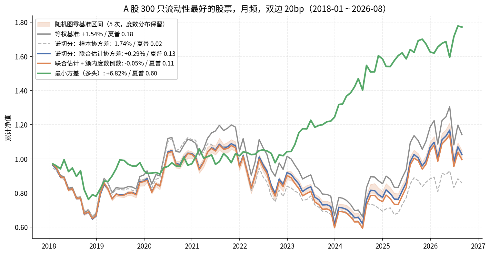
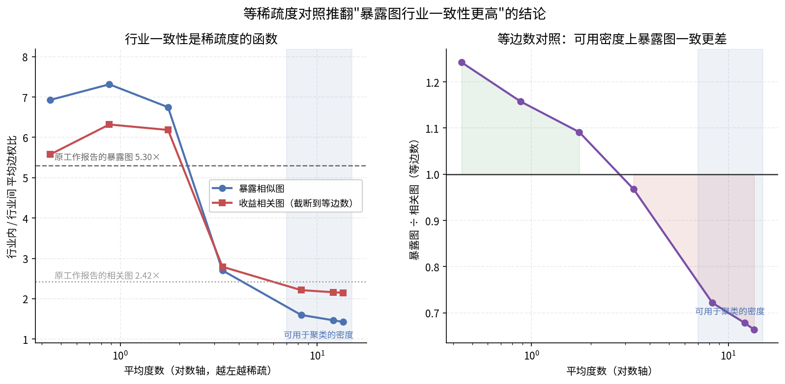

# 系统性成分的用途：分散化框架复现 —— **判负**

> **一句话结论**：把图建在因子暴露空间、并让因子与图联合估计的分散化框架，
> 在 A 股不成立。三项次级结论可复现，但三项主结论不复现，
> 两条原工作没做而我们补上的检验**全部判负**。
> 同一数据上，不需要预期收益的最小方差以 6.82%／夏普 0.599 胜过该框架的全部变体。
>
> 这**不改变**本项目的判断：残差分解的两半确实对应两类不同用途，
> 我们用特质那一半做错价是对的选择。系统性那一半的用途是分散化，
> 而分散化恰恰是本项目主动放弃的东西。

## ★ 判负清单

| # | 判负项 | 依据 |
|---|---|---|
| 1 | **簇内度数倒数加权（Contagion Cut）** | 低于**随机图零基准 2.1σ**（随机 +0.35%±0.19%／夏普 0.128±0.008，真实图 −0.05%／0.112）。置换节点标签后度数分布完全保留，只打乱"哪只股票在什么位置"——真实网络位置**劣于**随机指派 |
| 2 | **"暴露图行业一致性更高"** | 等稀疏度对照后**方向反转**。行业比是稀疏度的单调函数，相关图仅靠阈值截断即可从 2.15× 升到 6.32×（超过原工作报告的暴露图 5.30×）。在可用于聚类的密度上暴露图一致更差（0.66–0.72×） |
| 3 | **谱切分框架整体** | 三个协方差变体全部输给等权（≤0.125 vs 0.181），更远输给最小方差（0.599） |
| 4 | **聚类稳定性作为卖点** | 联合估计 NMI **0.370**，反不如样本协方差的 0.719（原工作报 0.768）。月换手 47%，20bp 下每年吃掉约 1.1pp |

**未判负（可复现）**：三个协方差的排序方向、条件数改善（26×，原工作称约两个数量级）、
市场状态依赖（2021–2023 全线负）。

**方法论留存**：随机图零基准（置换节点标签、保留度数分布）与等稀疏度图对照，
这两把尺子在本项目此前的网络类检验中已多次决定结论方向，
见 [`financial_structure_network.md`](financial_structure_network.md)。

---

## 一、为什么本项目一直只用了一半

本项目的联动网络建在**残差**上：120 日窗口内，先剔掉市场 beta 与申万一级行业均值，
再算残差相关，取 top-K=5 邻居。也就是说，收益被分成两半之后，我们**只留了特质那一半**。

这个选择是目的决定的。我们要找的是"邻居涨了、自己没跟上"的错价，
所以需要的是行业和市场解释不掉的那部分联系。共同的系统性波动对这个目的是噪声。

但那被扔掉的一半并非无用——它只是服务于另一个目的。**同一个残差分解，
特质那一半用于选股，系统性那一半用于分散化。** 对分散化来说，
"两只股票的因子暴露相近"恰恰是危险信号：名义上持有两只，实际是同一个敞口。

本章记录我们对这条线的一次检验。它**不接生产策略**，
两条线的目标相反，结论互不影响。

## 二、被检验的方法

一项公开工作提出：不要用收益相关建图，而把邻接关系定义在**因子暴露空间**，
并让因子与图在同一个优化过程中互相约束。核心目标函数（`src/research/mingle.py`）：

```
min_{B,F,W}  ||(R − B F) Ω^{1/2}||²      收益重构（时间指数加权，一年半衰期）
           + α Σ_ij W_ij ||b_i − b_j||²   暴露平滑（= 2α·tr(B'LB)）
           + β ||W||₁                     稀疏
           − γ Σ_i log(d_i)               对数度，抑制孤立点
           + δ ||offdiag(Cov_ω(F))||²     因子去相关
   s.t.  B'B = I,  W ≥ 0,  W = W',  diag(W) = 0
```

关键在于平滑项约束的是**暴露**在图上的变化，不是要求相邻股票的原始收益逐期接近。
个股的短期扰动要先经过低秩分解才能影响连边——这正是它与"直接用收益相关建图"的分野。

用 ADMM 交替求解：B 是 Sylvester 方程（特征分解），
正交约束靠极分解投影到 Stiefel 流形，图更新是投影梯度加度副本的解析解。
双线性项使问题非凸，ADMM 不保证全局最优。

配置侧：用估计出的协方差做自适应谱切分到 24 个叶子簇；
簇内权重取**加权度数的倒数**，让资金流向网络边缘的资产。

## 三、复现设置与偏离

单市场 A 股，按滚动 250 日中位成交额取前 300 只（原工作用三个市场各 100 只，
且固定 2017 年名单——我们改为滚动重选以规避幸存者偏差）。
两年训练窗、每月重估、双边 20bp，2018-01 至 2026-08 共 104 期。
因子数 6、叶子簇 24、一年半衰期沿用原设定。

**正则强度按结构目标标定，不按样本外表现调**——后者正是原工作自己提示要核查的泄漏来源。

**绝对水平不可跨市场比较。** 原工作的等权基准 2019–2026 年化 15.5%／夏普 0.780，
我们的等权基准 2018–2026 只有 1.54%／0.181（A 股 2021–2023 极差）。
只有**实验内部的对照**才有意义。

## 四、复现结果

### 4.1 保持配置算法不变，只替换协方差估计（原工作最有解释力的对照）

| 策略 | 年化 | 夏普 | MDD | 胜率 | 月换手 |
|---|---|---|---|---|---|
| 等权基准 | 1.54% | 0.181 | 44.95% | 46.2% | 5.9% |
| **最小方差（多头）** | **6.82%** | **0.599** | **23.38%** | 57.7% | 10.7% |
| 谱切分：样本协方差 | −1.74% | 0.019 | 46.51% | 45.2% | 47.3% |
| 谱切分：普通因子协方差 | −0.29% | 0.084 | 43.16% | 49.0% | 45.8% |
| 谱切分：联合估计协方差 | 0.29% | 0.125 | 43.27% | 47.1% | 46.9% |
| 联合估计 + 簇内度数倒数 | −0.05% | 0.112 | 45.05% | 48.1% | 50.2% |



**三个协方差之间的排序方向复现了**（样本 < 普通因子 < 联合估计）。
但两处不复现：

- 原工作报告"普通低秩比样本协方差**更差**"（0.768 < 0.836），我们相反（0.084 > 0.019）
- 原工作的谱切分**胜过等权**（0.836 > 0.780），我们**全部输给等权**（≤0.125 < 0.181）

### 4.2 ★ 随机图零基准（原工作没有做）

把图的节点标签随机置换：**度数分布完全保留，只打乱"哪只股票处在网络的什么位置"**。
这才能回答"图位置本身是否携带信息"，而不是"引入权重离散度是否有用"。

| | 年化 | 夏普 |
|---|---|---|
| 随机图零基准（5 次） | +0.35% ± 0.19% | 0.128 ± 0.008 |
| 簇内度数倒数（真实图） | −0.05% | 0.112 |
| **超出** | **−2.1σ** | **−2.1σ** |

**判负。** 真实的网络位置**劣于**随机指派的位置。
"向网络边缘倾斜"这个规则在我们的数据上不携带信息。

### 4.3 ★ 行业一致性：等稀疏度对照后方向反转

原工作的结构性证据是暴露图行业内/行业间边权比 5.30×，远高于相关图的 2.42×。

但这个对照不等价：**暴露图是稀疏的（L1 惩罚），相关矩阵是稠密的（所有元素非零）**。
图越稀疏，留下的越是最强的边，而最强的边天然更可能同行业——
行业比是稀疏度的单调函数。在每个稀疏度上做等边数对照（`11_mingle_industry_sparsity.py`）：

（7 个截面均值：2019–2025 每年 6 月末）

| 平均度 | 边数 | 边密度 | 暴露图行业比 | 相关图@等边数 | 暴露/相关 |
|---|---|---|---|---|---|
| 13.5 | 32195 | 0.72 | 1.42 | 2.15 | **0.66** |
| 12.1 | 31706 | 0.71 | 1.47 | 2.16 | **0.68** |
| 8.3 | 31327 | 0.70 | 1.60 | 2.21 | **0.72** |
| 3.3 | 21350 | 0.48 | 2.70 | 2.79 | 0.97 |
| 1.8 | 7666 | 0.17 | 6.75 | 6.18 | 1.09 |
| 0.9 | 7220 | 0.16 | 7.32 | 6.32 | 1.16 |
| 0.4 | 8364 | 0.19 | 6.93 | 5.58 | 1.24 |

**两条曲线都随稀疏度陡升**——相关图仅靠阈值截断就能从 2.15× 升到 6.32×，
已经超过原工作报告的暴露图 5.30×。

在**可用于聚类的密度**上（平均度 8–13），暴露图的行业一致性**一致低于**相关图
（0.66–0.72×）；只有当图接近断开（平均度 < 2，即多数节点仅剩一两个邻居）时才反超，
而那样的图撑不起谱切分。

结论：**5.30× vs 2.42× 这个对照被稀疏度混淆了。**



### 4.4 其余诊断

| 项 | 原工作 | 我们（A 股） | 判定 |
|---|---|---|---|
| 协方差条件数改善 | 约两个数量级 | 2.18e4 → 843（26×） | 方向复现，幅度小得多 |
| 相邻期聚类 NMI | 0.768 | 联合 **0.370**／样本 0.719 | **不复现**：联合估计反而更不稳 |
| 菲德勒选中率 | 联合 85.9% ≫ 样本 15.9% | 联合 47.7% < 样本 90.6% | 口径不同，不可直接比 |
| 市场状态依赖 | 危机期夏普 −2.98 | 2021–2023 全线负 | **复现** |

NMI 这条值得单说：原工作把聚类稳定性列为优点（"较稳定的成员归属有助于减少
由分组调整引起的交易需求"）。我们测到的是**样本协方差的聚类（0.719）接近原工作报告值，
而联合估计的聚类只有 0.370**——引入图约束反而让分组更不稳。
月换手 47% 与之一致，在 20bp 下每年吃掉约 1.1pp。

> 换手上有一处交叉验证支持我们的实现是靠谱的：原工作 20bp→50bp 掉 1.6pp，
> 反解出的月度单边换手约 37%，与我们实测的 47% 同量级。原工作未直接报告换手。

## 五、原工作可能缺的基线

其表中"均值方差优化 5.48%／夏普 0.333"是最差的对照。但 MVO 需要**预期收益**估计，
而预期收益是出了名的难估——它输给等权很可能是这个原因，与协方差无关。

不需要预期收益的**最小方差**才是"简单风险配置"的公平基线。
在我们的数据上它是 **6.82%／0.599／MDD 23.4%**，把全部谱切分变体和等权都甩开很远，
月换手只有 10.7%。

**一个复杂框架要证明自己，得先赢过最小方差，而不是赢过等权和 MVO。**

## 六、结论一览

| | 判定 |
|---|---|
| 协方差替换的排序方向 | 复现 |
| 条件数改善 | 方向复现，幅度小 |
| 市场状态依赖 | 复现 |
| 谱切分整体胜过等权 | **不复现**（全部输给等权） |
| 聚类稳定性 | **不复现**（联合 0.370 反不如样本 0.719） |
| 行业一致性优势 | **反转**（等稀疏度下 0.66–0.71×） |
| 簇内度数倒数加权 | **判负**（低于随机图零基准 2.1σ） |

方法在 A 股不成立。但这不改变第一节的判断：
**残差分解的两半确实对应两类不同用途**，我们用特质那一半做错价是对的选择。
系统性那一半的用途是分散化——而分散化恰恰是本项目主动放弃的东西
（小盘集中暴露是收益来源本身，压一半 SIZE 敞口要付 6.1pp 超额，
见 [`robustness_and_weighting.md`](robustness_and_weighting.md)）。

## 七、复现的边界

实现依据的是公开文字描述，未见其代码。以下三处描述不明确，我们的选择已在代码中标注：

1. **"自适应谱切分"的备选与判据**——我们取前 2–4 小的归一化拉普拉斯特征向量，
   判据为归一化割最小。菲德勒选中率与原工作不可直接比，原因在此。
2. **簇间配置规则**——原文未说明，我们用基于簇方差的递归二分。
3. **四个正则强度**——原文未给，我们按结构目标（平均度数）标定。

因此"不复现"应读作"按公开描述的这一实现，在 A 股不成立"，
而非"原方法错误"。可复现的部分（协方差排序、条件数、状态依赖）说明实现方向大体正确。
